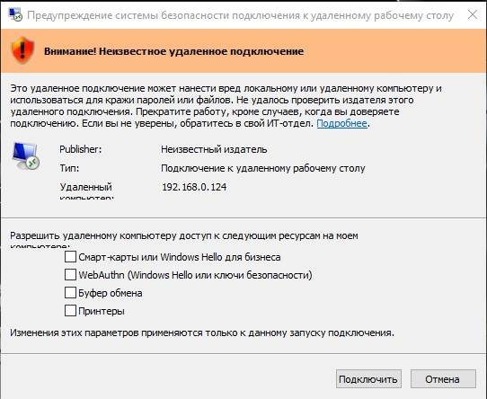

# RDP Warning Manager RU

Один BAT-файл для управления предупреждением безопасности RDP в Windows.

Скрипт помогает отключить или вернуть стандартное предупреждение, которое появляется при подключении к неподписанному или недоверенному RDP-файлу и каждый раз просит подтвердить доступ к локальным ресурсам: буферу обмена, принтерам, смарт-картам и другим устройствам.



## Какую проблему решает

В Windows при открытии некоторых `.rdp`-файлов появляется окно:

> Внимание! Неизвестное удаленное подключение

В этом окне нужно вручную подтверждать подключение и параметры перенаправления локальных ресурсов. Это неудобно, если пользователь регулярно подключается к одному и тому же доверенному RDP-серверу.

`rdp_warning_manager_ru.bat` позволяет:

- отключить это предупреждение через политику клиента RDP;
- включить предупреждение обратно;
- посмотреть текущее состояние настройки.

## Что меняет скрипт

Скрипт управляет параметром реестра:

```text
HKLM\Software\Policies\Microsoft\Windows NT\Terminal Services\Client
RedirectionWarningDialogVersion = 1
```

Если параметр `RedirectionWarningDialogVersion` равен `1`, предупреждение RDP отключается через политику клиента.

Если параметр удалить, Windows возвращается к стандартному поведению.

## Как использовать

1. Скачайте файл `rdp_warning_manager_ru.bat`.
2. Нажмите по нему правой кнопкой мыши.
3. Выберите `Запуск от имени администратора`.
4. В меню выберите нужное действие:

```text
1 - ОТКЛЮЧИТЬ предупреждение с галочками буфера обмена/принтеров
2 - ВКЛЮЧИТЬ предупреждение обратно
3 - Показать текущее состояние настройки
0 - Выход
```

После изменения настройки закройте все окна удаленного рабочего стола и подключитесь заново.

## Важно

Используйте отключение предупреждения только для RDP-файлов и серверов, которым доверяете.

Предупреждение существует не просто так: оно сообщает, что Windows не может полностью подтвердить издателя подключения. Если вы не уверены в источнике RDP-файла, лучше оставить стандартное поведение Windows.

## Совместимость

- Windows 10
- Windows 11
- Windows Server с клиентом удаленного рабочего стола

Скрипт не использует PowerShell, base64, временные файлы или скрытые загрузчики. Это обычный редактируемый BAT-файл с русскими сообщениями.

## Кодировка файла

BAT-файл сохранен в кодировке Windows-1251 и в начале выполняет:

```bat
chcp 1251 >nul
```

Это нужно, чтобы русский текст корректно отображался в `cmd.exe`.

Если редактор показывает внутри BAT-файла некорректные символы, откройте файл с кодировкой `Cyrillic (Windows 1251)` / `Windows-1251`.
